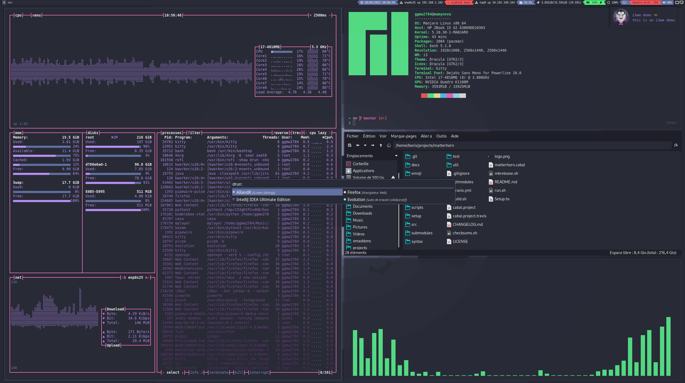

# my dotfiles @home for manjaro

## sway + picom + wofi + dunst + feh + pcmanfm + zathura + kazam

## kitty + tmux + tmuxp + tmux-tpm

## fish + fisherman + oh-my-fish + starship

## neovim + spacevim + vim-plug

## cargo + composer + gem + pip + npm + ghc-pkg + pacman
